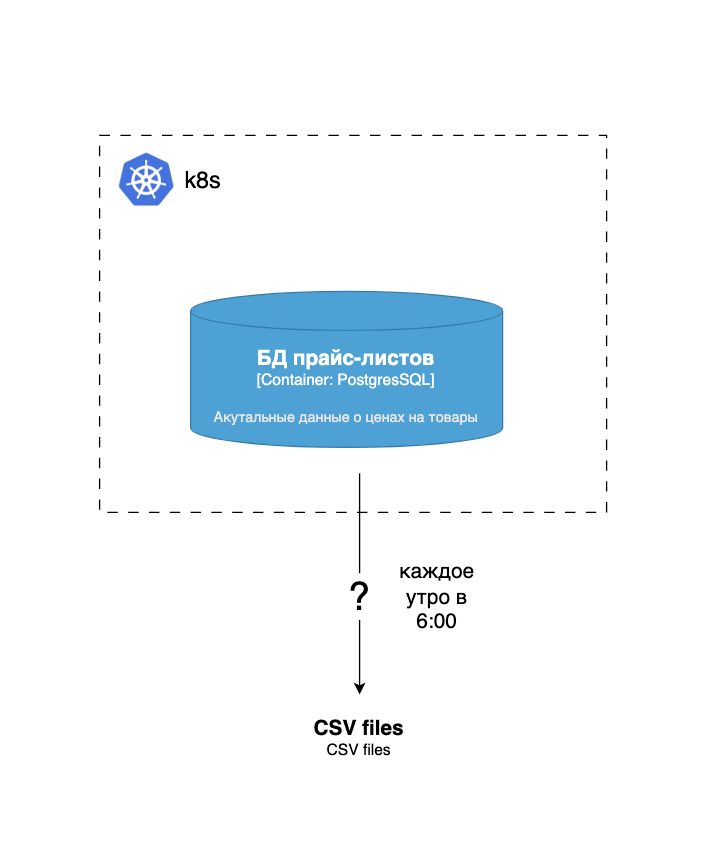
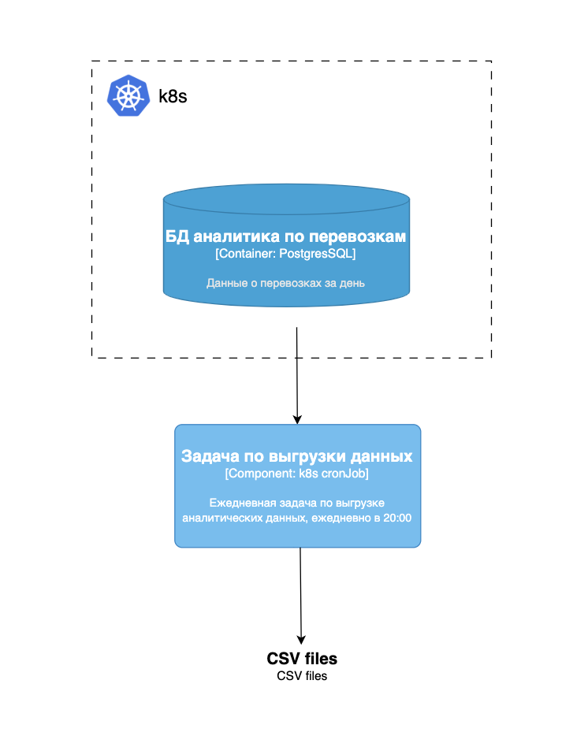
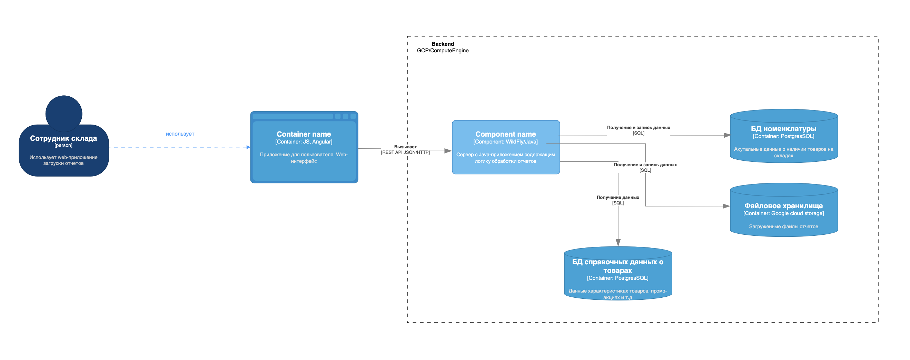

# Проектная работа пятого спринта по курсу Микро-сервисная архитектура от Яндекс Практикума

Проектная работа этого спринта состоит из двух частей. В первой вас ждут три независимых друг от друга задания. Вторая часть сложнее. В ней также будут три задания, но они объединены общим кейсом.

Рекомендуем сначала выполнить задания первой части проектной работы как более простые и только затем перейти ко второй. Однако вы можете выполнить задания в удобном вам порядке.

## Перед тем как перейти к выполнению заданий, подготовьте репозиторий

### Что нужно сделать

Сделайте форк репозитория с исходными файлами для выполнения проектной работы:  
https://github.com/Yandex-Practicum/msa-project-5

Проект состоит из шести заданий. Для них в репозитории создана папка `tasks`. Работать над заданиями вы можете в удобном месте. Результаты сложите в подпапку `results` для каждого из заданий.

Когда вы выполните все задания проекта, создайте пул-реквест из веток с результатами заданий в основную ветку вашего репозитория. Убедитесь, что пул-реквест содержит все изменения, которые вы вносили.

## Какие инструменты нужны для работы

Для работы над заданиями вам понадобятся:

- Docker Compose
- MiniKube
- PostgreSQL
- ELK, Prometheus, Grafana
- Draw.io

## Часть 1

## Задание 1. Выбор и реализация решения для пакетной обработки данных

Маркетинговый отдел планирует расширенно обрабатывать данные клиентов, объединяя их из разных источников, и формировать отчёты. В работе используются данные из разных источников: файловое хранилище CSV-файлов, содержащих статусы доставок пользователей, таблицы PostgreSQL с информацией о заказах, данные о платежах по заказам, расширенные данные о пользователях и данные из Kafka с цепочкой событий по модификации заказов.

Текущая система обработки не справляется с нагрузкой и запрашиваемым функционалом. Поэтому необходимо выбрать и обосновать технологическое решение для пакетной обработки данных.

Логика обработки подразумевает возможность гибко формировать пайплайн, интегрировать его с внешними API, BigQuery, Redshift, Kafka и Spark, а также поддерживать встроенный мониторинг и оповещения. Ожидаемый объём обрабатываемых данных за один запуск пайплайна — около 1 млн.

Продемонстрируйте локально развёрнутое решение, которое впоследствии компания сможет применить в облачной инфраструктуре.

## Что нужно сделать

### Обосновать выбор технологического решения

- Опишите, как выбранное решение можно интегрироваться с BigQuery, Redshift, Kafka и Spark, отметив, есть ли для него готовые модули, которые ускорят разработку.
- Решение поддерживает возможность ветвления, условных операторов и event-triggers?
- Можно ли использования из коробки fallback-logic, retry и отправку email-уведомлений?
- Обоснуйте, как решение будет развёрнуто в облачной среде.

### Продемонстрировать POC (Proof of Concept) на примере простого проекта

Запишите скринкаст или сделайте скриншоты. Должно быть видно локально развёрнутое решение и простой пайплайн, который содержит следующие шаги:

- Чтение из источника данных (база данных, файловая система).
- Анализ данных и ветвление пайплайна при выполнении условия.
- Настройка email-уведомления при успешном и неуспешном завершении пайплайна.
- Настройка retry-политики для шагов пайплайна.

В результате у вас должно получиться обоснование выбранного решения, файл (или файлы) с кодом/конфигурацией пайплайна и демонстрация его в локальном развёртывании в виде скринкаста или скриншотов.

Загрузите всё в директорию `Task1` вашего репозитория.

## Задание 2. Разработка дизайна модуля пакетной обработки данных

Каждое утро ровно в шесть онлайн-магазину нужно сгенерировать кастомные CSV/XLS-прайс-листы для B2B-клиентов на основе текущих данных в БД. Процесс выгрузки не требует дополнительной логики по обработке данных.

Данные в PostgreSQL представлены в таблицах:

- `products` ~ 5 000–10 000 строк;
- `categories` ~ 50–200 строк;
- `clients` ~ 100–500 строк;
- `client_prices` ~ 10 000–20 000 строк.

Необходимо связать данные из таблиц и выгрузить их в CSV-файл. Объём данных 5 000–10 000 строк. Инфраструктура магазина — микросервисы в облаке.

Диаграмма As Is состояния системы:

## Что нужно сделать

### Обоснуйте выбор технологического решения

Вы можете воспользоваться шаблоном, на основе которого раскрыть собственные мысли, почему вы остановились именно на таком решении.

| Критерий | Spring Batch | Apache Airflow | K8s Job | Spark |
|----------|-------------|----------------|---------|-------|
| Наличие конфигурации CRON-расписания |  |  |  |  |
| Сложность реализации логики по обработке данных |  |  |  |  |
| Ресурсоёмкость решения (количество потребляемых ресурсов) |  |  |  |  |
| Масштабируемость решения под нагрузкой и сложность реализации |  |  |  |  |
| Сложность развёртывания в облаке и интеграция с имеющейся микросервисной архитектурой |  |  |  |  |
| Удобство интеграции с системами логирования и мониторинга |  |  |  |  |

### Составьте диаграмму контекста C4-архитектуры системы To Be

Опишите, как будет работать решение.

### Подготовить верхнеуровневый пошаговый план конфигурации и его имплементации

План должен выполнять требуемый функционал.

---

В результате у вас должен получиться:

- файл с заполненной таблицей и выводами, обосновывающими выбор решения;
- C4-диаграмма To Be;
- документ с наброском верхнеуровневого плана по имплементации и конфигурации решения.

Загрузите всё в директорию `Task2` вашего репозитория.

## Задание 3. Реализация Distributed Scheduling с k8s CronJob

Онлайн-платформа занимается грузоперевозками. Каждый день ровно в восемь вечера ей нужно выгружать данные в специализированное хранилище для аналитиков. На основе выгруженных данных обновляются дашборды дневной отчётности. В связи с текущим стеком и опытом разработчиков остановили на k8s CronJob.

Ежедневный объём данных включает следующие таблицы:

- `shipments` (перевозки) ~ 50 000–200 000 строк;
- `shipment_events` (события по перевозкам) ~ 500 000–1 000 000 строк;
- `drivers` (водители) ~ 1 000–5 000 строк;
- `vehicles` (транспорт) ~ 500–2 000 строк;
- `clients` (заказчики) ~ 10 000–50 000 строк.

### Диаграмма To Be состояния системы:

## Что нужно сделать

Подготовьте `yaml`-файлы конфигурации, которые выполняют требуемый функционал. Достаточно реализовать метод простого экспорта данных одной таблицы из БД на удобном вам языке программирования.

В результате у вас должны получиться:

- конфигурационные файлы для создания Docker-образа;
- конфигурационные файлы `k8s job`, чтобы использовать Docker-образ с `cron`-конфигурацией;
- видео или скриншоты, которые продемонстрируют работу `k8s job` в MiniKube.

Загрузите всё в директорию `Task3` вашего репозитория.

# Часть 2

В этой части вас ждут три задания, которые объединены общим кейсом. Так как задания сложнее, мы дадим больше контекста, чтобы лучше понять ситуацию в компании и её цели.

## О компании

**TradeWare** — развивающаяся компания, которая предоставляет малому и среднему бизнесу складские решения для хранения стройматериалов. Речь идёт об API для интеграции со складскими системами и управления товарными остатками.

## Проблематика

Технологическая база компании не готова полностью к обработке больших объёмов данных, характерных для пиковых периодов поставок и строительного сезона.

В периоды активного строительства — особенно весной и летом — резко возрастает количество операций, связанных с движением товарных остатков, оформлением заявок на поставку и внутренней логистикой между складами. В это время фиксируются обращения от сотрудников, что отчёты по остаткам «висят», обновления позиций происходят с большой задержкой либо вовсе не применяются.

Замедляется работа ERP-интерфейса при формировании складских заданий и приёме материалов.

В IT-инфраструктуре отсутствуют средства мониторинга системы. Есть только логи в файл и стандартный мониторинг ресурсов VM и WildFly.

Сейчас IT-инфраструктура — это монолит, предоставляющий пользовательский интерфейс, куда сотрудник склада загружает отчёт об остатках и перемещениях в конце рабочей смены.

## Нагрузка на систему

Максимальная зафиксированная нагрузка на систему обновления остатков — обработка примерно 400 000 строк в сутки, поступающих с региональных складов в виде файлов. В процессе обработки происходит:

- валидация формата и целостности поступающих данных;
- обновление позиций актуальной справочной информацией на основе обновлений на складах, изменений промоакций и так далее;
- загрузка обновлённых данных из загруженного отчёта в результирующую таблицу.

Необходимость обновления по остаткам позволяет держать систему в актуальном состоянии, предоставляя клиентам ежедневную актуальную информацию по наличию товаров на складах, скидкам, промоакциям и так далее.

Нагрузка в пиковые дни (например, при передаче стройматериалов на крупные объекты) возрастает в 2–3 раза. Это перегружает систему, из-за чего падает операционная эффективность. В результате задержки в загрузке данных мешают планировать снабжение, приводят к просрочкам поставок и неэффективной логистике. На уровне клиентов возникают цепные задержки в строительных процессах, что провоцирует финансовые и репутационные риски.

При низкой нагрузке, когда операций по складам меньше, система работает стабильно: интерфейсы отзываются и логистические цепочки формируются без сбоев.

Это позволяет сделать вывод, что основная проблема кроется вовсе не в интерфейсах или бизнес-логике, а в неспособности IT-инфраструктуры адаптироваться под возрастающую нагрузку и работу с большим объёмом данных в короткие сроки.

## Попытка мигрировать к микросервисной архитектуре

Столкнувшись с проблемами производительности, TradeWare начала подготовку к миграции в микросервисную архитектуру. Монолит БД перенесли на Google Cloud Platform (GCP), а хостинг файлов с отчётами — в Google Cloud Storage (GCS).

Однако отсутствие пакетной обработки приводит к необходимости обрабатывать каждую запись отдельно в «онлайн-режиме», что негативно сказывается на производительности всей системы:

- обновления остатков в БД идут построчно, что перегружает транзакционные ресурсы;
- отчётность формируется в реальном времени, хотя её можно унести в ночную пакетную обработку;
- API для взаимодействия с логистическими партнёрами и региональными складами страдают от задержек и взаимного блокирования, когда один поток данных тормозит все остальные;
- в случае ошибок трудно отследить причину её возникновения и свести имеющиеся логи и метрики в одну картину.

Как вы видите, у TradeWare прямо назрела необходимость внедрить пакетную обработку данных и систему мониторинга и оповещения. Так можно будет разгрузить онлайн-компоненты, повысить стабильность в пиковые периоды и масштабировать системы при росте бизнеса.

## Структура компании

- команды фронтенд- и бэкенд-разработки и DevOps;
- операционные отделы: отдел складской логистики и отдел по работе с партнёрами;
- бизнес и аналитика: отдел продаж и отдел аналитики и отчётности;
- служба поддержки клиентов и партнёров.

## Разрабатываемые продукты

- **Монолитное бэкенд-приложение на Java**: отображает складские остатки, обрабатывает перемещения товаров и формирует отчёты о складских операциях для внутреннего и внешнего (партнёрского) использования.
- **Сервис учёта хранения и логистических операций**: формирует отчёты о движении товаров и выгружает их в CSV по факту перемещения товаров.
- **Фронтенд-приложение**: интерфейс для сотрудников склада и менеджеров и отображение текущих остатков товаров, истории перемещений и аналитики.

## Стек

- **Бэкенд**: Java 11, WildFly, PostgreSQL, GCS;
- **Фронтенд**: Angular, WebSockets;
- **DevOps**: Docker, Docker Compose, GCP.

## Диаграмма С4 текущего сценария обработки загружаемого отчёта:

## Пояснения к схеме:

Пользователь на основе Excel-шаблона формирует отчёт по остаткам и сохраняет его как CSV-файл. Поэтому первичная валидация формата данных происходит на уровне Excel-шаблона.

Пользователь запускает загрузку полученного CSV-файла через интерфейс ERP:

1. Файл проходит дополнительную валидацию на уровне Java-приложения. В случае ошибки пользователь получает ответ в браузере: «Ошибка формата загружаемых данных».
2. Файл сохраняется в хранилище в GCS.
3. Запускается процесс обработки файла, обновление значениями из БД справочных данных и сохранения данных в БД номенклатуры.
4. Если операция обработки завершается успешно, то пользователь получает уведомление об этом.

Пользователь дожидается успешного завершения загрузки.

При ошибке в формате данных пользователь вносит необходимые исправления в отчёт и повторяет загрузку.

## Ожидание роста нагрузки

В ближайшее время TradeWare планирует запустить масштабную рекламную кампанию, чтобы привлечь новых партнёров и клиентов. Поэтому компания ждёт значительный рост числа пользователей, заявок на хранение, а также объёмов данных по движениям и остаткам товаров на складах. Помимо этого, TradeWare собирается расширить номенклатуру товаров и интеграцию с другими источниками данных, что потребует гибких способов проектирования пайплайна данных и retry-механизмы в них.

## Цели бизнеса

### Промежуточное состояние (через пару месяцев)

Сформирован план, как решить уже имеющиеся проблемы с производительностью системы, в частности — подготовить её к росту объёма обрабатываемых данных.

### Ключевые направления:

- обеспечение надёжной работы под возрастающей нагрузкой. Предполагаемая нагрузка — 100–150 параллельных загрузок в пиковые часы. Также нужна возможность гибко масштабироваться под нагрузкой;
- соблюдение требований к производительности: среднее время обработки отчёта на 2 000 строк составляет до 30 секунд;
- внедрение системы централизованного сбора логов и метрик;
- формирование решения для дальнейшей миграции в микросервисную архитектуру. Оно должно позволить постепенно вынести функционал из монолита в развёрнутые рядом сервисы, интегрироваться с Java-экосистемой и внедрять инструменты логирования и мониторинга, которые будут удобно сочетаться с микросервисной архитектурой.

## Задание 4. Реализация ETL с использованием Spring Batch

У инжиниринг-лида был опыт работы только со Spring Batch, поэтому он и предложил использовать его. Необходимо удостовериться, что это решение будет действительно лучшим для проекта, и продемонстрировать локально развёрнутое решение, которое впоследствии компания может применить в облачной инфраструктуре.

## Что нужно сделать

- Проанализируйте проблемы в кейсе.
- Проработайте архитектурное решение для использования Spring Batch как технологического решения для ETL-операций и хранения данных.
- Результат представьте в виде ADR и С4-диаграммы с демонстрацией архитектуры системы с внедрённым Spring Batch-компонентом.
- Предложите альтернативные опции помимо Spring Batch.

Чтобы сдать решение в формате ADR, используйте [ADR1.md](ADR1.md)

- Реализовать работу ETL-приложения, используя Spring Batch

Фреймворк обрабатывает данные из CSV-файлов, наполняет те информацией и сохраняет в результирующую таблицу в PostgreSQL. Необходимо предоставить POC на примере имплементации Spring Batch-приложения с ETL-шагом для загрузки данных о товарах из файла `product-data.csv`, обновления данных по программе лояльности из таблицы `loyality_data` и выгрузки обновлённых данных в таблицу `products`.

Результат представьте в виде CSV-файлов, `docker-compose` файла с PostgreSQL и темплейтом для Java-приложения проекта Spring Batch-приложения, который нужно доработать.

🔍 Приложение написано на Java. Мы понимаем, что не все владеют этим языком, поэтому подготовили в репозитории шаблон приложения и файл `docker-compose` для запуска проекта и БД.

После реализации архитектурного решения запустите `docker-compose`, создайте необходимые таблицы на основе `schema-all.sql` и продемонстрируйте логи и обновлённые данные в таблице `products`.

В `README.md` лежит дополнительная информация о том, как подготовить окружение.

## В результате у вас должно получиться:

- ADR с обоснованием решения;
- C4-диаграмма архитектуры системы с внедрённым Spring Batch-компонентом;
- `docker-compose` файл и Java-проект с доработанным Spring Batch-приложением;
- видео или скриншоты, которые будут демонстрировать функционал разработанного решения.

Загрузите всё в директорию `Task4` вашего репозитория.